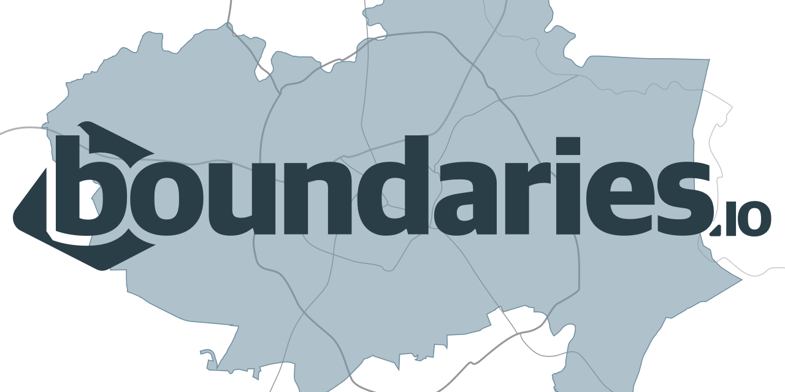

  

Bitmode Boundaries is an API for retrieving GeoJSON for common US geographic topologies.
Data is mostly comprised of US Census TIGER data—yielding up-to-date information on the
census-defined geographies converted from Shapefile format.

You can query the Boundaries API to retrieve GeoJSON documents with the
same meta properties as the original shapefiles.

## Looking to use the API?

[See API Pricing](https://boundaries.io/#pricing)

